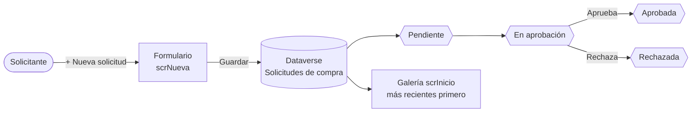

# Flujo de una solicitud de compra

```mermaid
flowchart LR
    A([Solicitante]) -->|"+ Nueva solicitud"| B[Formulario<br/>scrNueva]
    B -->|Guardar| C[(Dataverse<br/>Solicitudes de compra)]
    C --> D{{Pendiente}}
    D --> E{{En aprobación}}
    E -->|Aprueba| F{{Aprobada}}
    E -->|Rechaza| G{{Rechazada}}
    C --> H[Galería scrInicio<br/>más recientes primero]
```

<!-- TODO: si exportas el diagrama como imagen, guárdalo como docs/flujo.png -->
